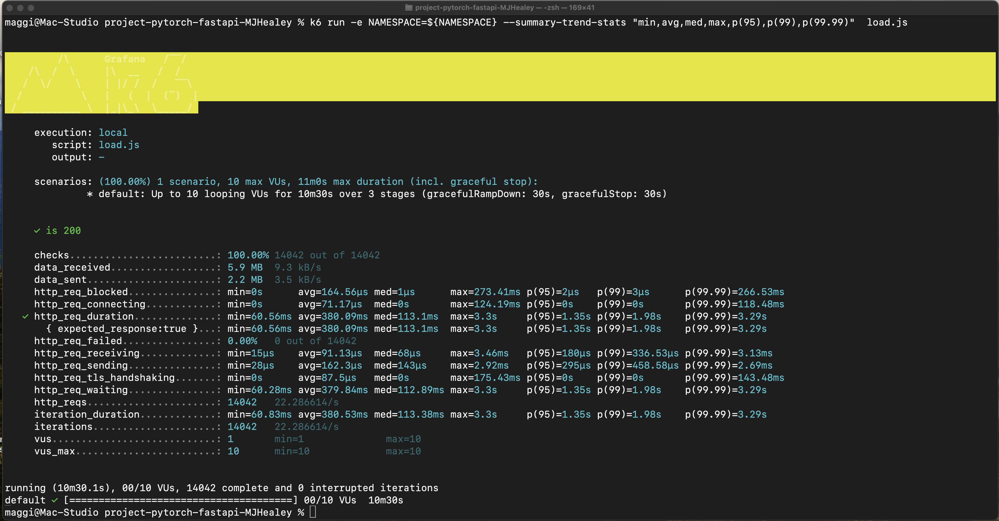
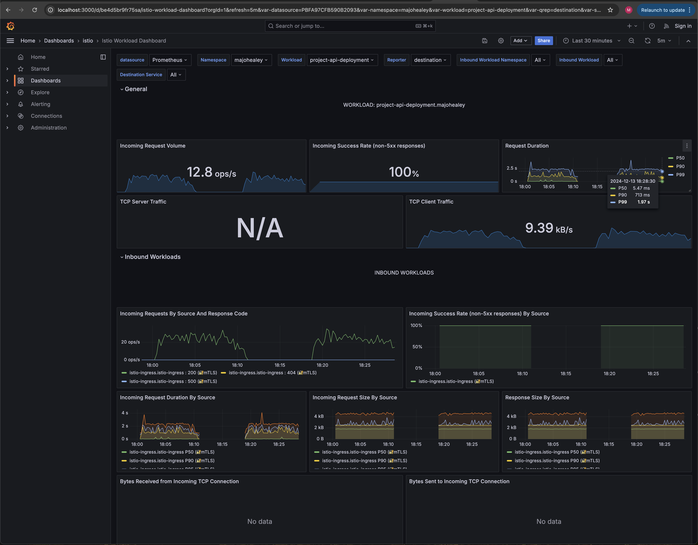
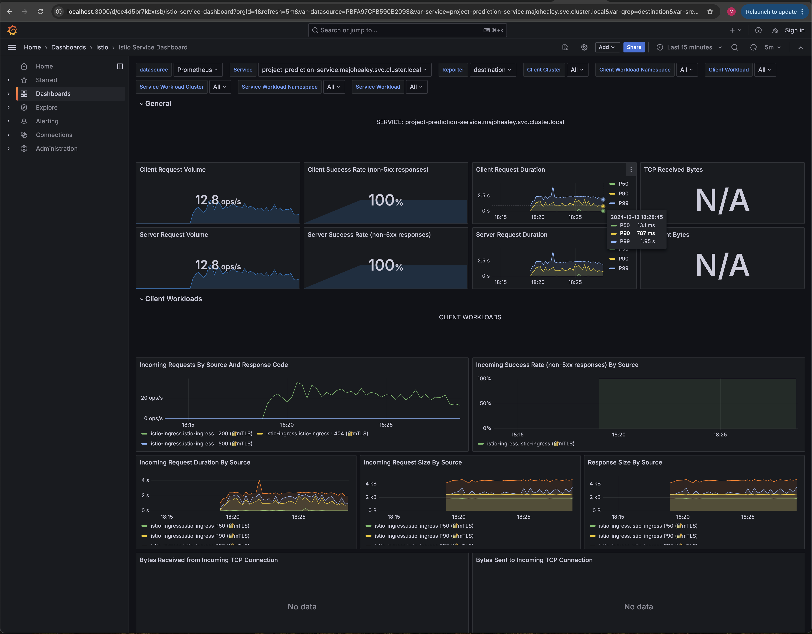
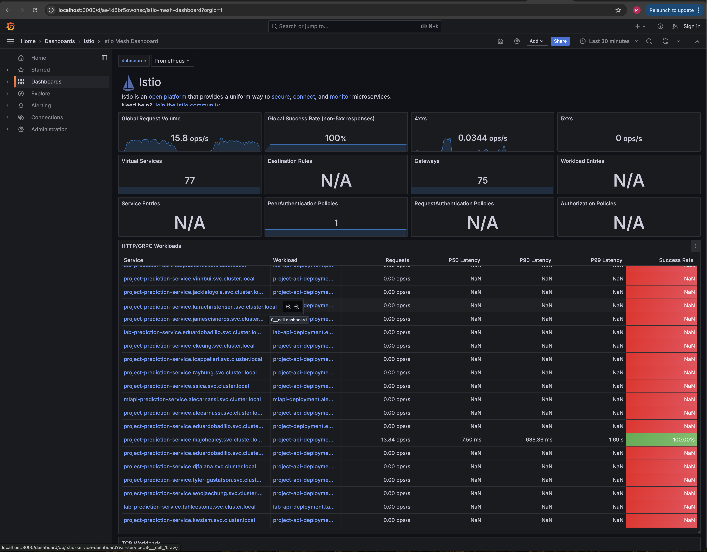

# ML API Deployment
**Full End-to-End Machine Learning API**
`UC Berkeley · Dec 2024`

---

## Overview

Developed and deployed a production-ready REST API serving a pre-trained DistilBERT 
sentiment analysis model, implementing caching, containerization, and Kubernetes 
orchestration on a pre-configured Azure environment — validated through load testing 
and real-time monitoring.

---

## Contents

| File | Description |
|------|-------------|
| `k6-load-test.png` | k6 load test results |
| `istio-workload-dashboard.png` | Grafana workload monitoring dashboard |
| `istio-service-dashboard.png` | Grafana service monitoring dashboard |
| `istio-mesh-dashboard.png` | Grafana mesh monitoring dashboard |

**Note:** Code is not publicly available per course policy. 
> Screenshots of load testing and monitoring dashboards are provided as proof of work.

---

## Architecture

The application was developed and deployed across the following stack:

| Layer | Technology |
|-------|------------|
| NLP Model | DistilBERT (HuggingFace) — sentiment analysis |
| API Framework | FastAPI + Pydantic validation |
| Caching | Redis — response caching to reduce latency |
| Containerization | Docker + Poetry |
| Orchestration | Kubernetes (AKS) with Istio service mesh |
| Cloud Platform | Azure Container Registry + Azure Kubernetes Service |
| Load Testing | k6 |
| Monitoring | Grafana dashboards |

---

## Key Implementation Details

- Packaged DistilBERT model directly into the Docker image at build time to avoid 
  pulling ~500 MB from HuggingFace on pod startup — critical for fast scaling
- Implemented Redis caching layer to protect the endpoint and reduce redundant 
  inference calls
- Configured Horizontal Pod Autoscaler (HPA) for dynamic scaling under load
- Deployed both project and lab services behind a single Istio Virtual Service, 
  routing by URL path (`/project` and `/lab`)
- Validated schema consistency using Pydantic input/output models

---

## Performance Results

Validated through k6 load testing over a 10-minute sustained load:

- **14,000+** requests served
- **Median response time: 113 ms**
- **95%+ cache hit rate**
- System monitored in real time via Grafana Istio dashboards

---

## Monitoring Screenshots

**k6 Load Test**

**Istio Workload Dashboard**

**Istio Service Dashboard**

**Istio Mesh Dashboard**

---
